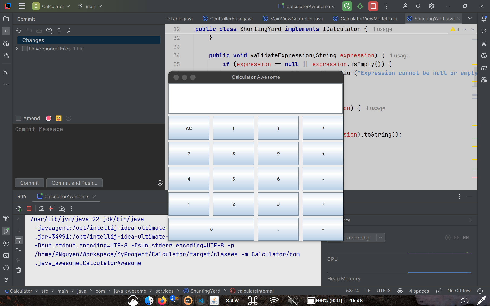

<h1 align="center">
  <a href="https://github.com/Phunguy65/calculatorawesome">
    <!-- Please provide path to your logo here -->
    
  </a>
</h1>

  CalculatorAwesome
   
  <a href="#about"><strong>Explore the screenshots »</strong></a>
   
   
  <a href="https://github.com/Phunguy65/calculatorawesome/issues/new?assignees=&labels=bug&template=01_BUG_REPORT.md&title=bug%3A+">Report a Bug</a>
  ·
  <a href="https://github.com/Phunguy65/calculatorawesome/issues/new?assignees=&labels=enhancement&template=02_FEATURE_REQUEST.md&title=feat%3A+">Request a Feature</a>
  .
  <a href="https://github.com/Phunguy65/calculatorawesome/issues/new?assignees=&labels=question&template=04_SUPPORT_QUESTION.md&title=support%3A+">Ask a Question</a>

 

Table of Contents

- [About](#about)
  - [Built With](#built-with)
- [Getting Started](#getting-started)
  - [Prerequisites](#prerequisites)
  - [Installation](#installation)
- [Usage](#usage)
- [Roadmap](#roadmap)
- [Support](#support)
- [Contributing](#contributing)
- [Authors & contributors](#authors--contributors)
- [License](#license)

---

## About

This is a simple calculator app that can perform basic arithmetic operations.

Screenshots

 

> 

|                              Calculator Awesome                               |
|:-----------------------------------------------------------------------------:|
|  |

### Built With

- [Java](https://www.java.com/)
- [Swing Java](https://docs.oracle.com/javase/22/docs/api/javax/swing/package-summary.html)
## Getting Started

### Prerequisites

> **[?]**
> What are the project requirements/dependencies?

### Installation

> **[?]**
> Describe how to install and get started with the project.

## Usage

> **[?]**
> How does one go about using it?
> Provide various use cases and code examples here.

## Roadmap

See the [open issues](https://github.com/Phunguy65/calculatorawesome/issues) for a list of proposed features (and known issues).

- [Top Feature Requests](https://github.com/Phunguy65/calculatorawesome/issues?q=label%3Aenhancement+is%3Aopen+sort%3Areactions-%2B1-desc) (Add your votes using the 👍 reaction)
- [Top Bugs](https://github.com/Phunguy65/calculatorawesome/issues?q=is%3Aissue+is%3Aopen+label%3Abug+sort%3Areactions-%2B1-desc) (Add your votes using the 👍 reaction)
- [Newest Bugs](https://github.com/Phunguy65/calculatorawesome/issues?q=is%3Aopen+is%3Aissue+label%3Abug)

## Support

> **[?]**
> Provide additional ways to contact the project maintainer/maintainers.

Reach out to the maintainer at one of the following places:

- [GitHub issues](https://github.com/Phunguy65/calculatorawesome/issues/new?assignees=&labels=question&template=04_SUPPORT_QUESTION.md&title=support%3A+)
- Contact options listed on [this GitHub profile](https://github.com/Phunguy65)

## Contributing

First off, thanks for taking the time to contribute! Contributions are what make the open-source community such an amazing place to learn, inspire, and create. Any contributions you make will benefit everybody else and are **greatly appreciated**.

Please read [our contribution guidelines](docs/CONTRIBUTING.md), and thank you for being involved!

## Authors & contributors

The original setup of this repository is by [Nguyen Ngoc Phu](https://github.com/Phunguy65).

For a full list of all authors and contributors, see [the contributors page](https://github.com/Phunguy65/calculatorawesome/contributors).

## License

This project is licensed under the **MIT license**.

See [LICENSE](LICENSE) for more information.

